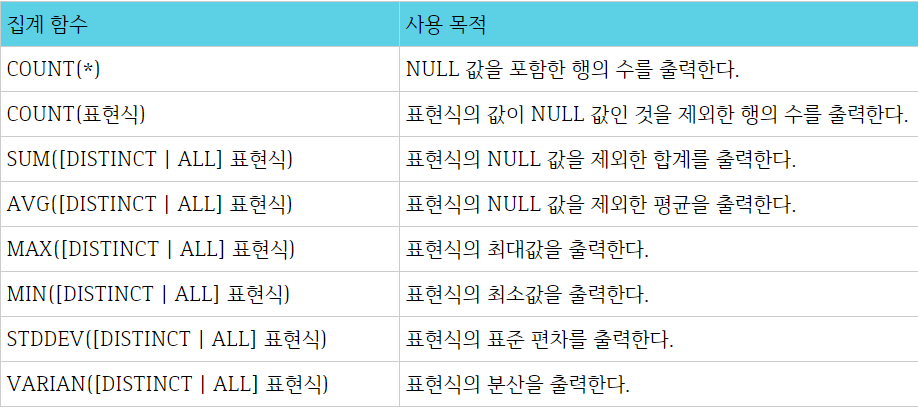
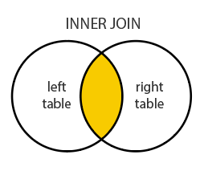
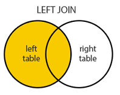
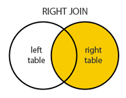

# 코딩 테스트 대비 : SQL

- SQL은 **Structured Query Language ( 구조적 질의 언어 )** 의 줄임말로 관계형 데이터베이스(RDBMS)에서 자료를 관리 및 처리하기 위해 설계된 언어입니다.
- SQL 문법은 크게 3가지의 종류로 나뉩니다.
  - DDL(Data Definition Language, 데이터 정의 언어) : 각 릴레이션을 정의하기 위해 사용되는 언어입니다.
    - CREATE, ALTER, DROP 등
  - DML(Data Manipulation Language, 데이터 조작 언어) : 데이터를 추가/수정/삭제하기 위한, 즉 데이터 관리를 위한 언어 입니다.
    - SELECT, INSTERT, UPDATE 등
  - DCL(Data Control Language, 데이터 제어 언어) : 사용자 관리 및 사용자별로 릴레이션 또는 데이터를 관리하고 접근하는 권한을 다루는 언어입니다.
    - GRANT, REVOKE 등


## CRUD

### 1. INSERT

```sql
INSERT INTO 테이블이름 ( COLUMN... ) VALUES ( DATA... )
```

```sql
INSERT INTO table (title, description, date) VALUES ('밀키스', '음료수입니다.', NOW())
```

```sql
/* 전체 COLUMN에 DATA를 넣을 경우 생략 가능 */
INSERT INTO table VALUES ('밀키스', '음료수입니다.', NOW())
```


### 2. SELECT ( 중요 )

- 모든 데이터 출력

```sql
SELECT * FROM 테이블이름
```

- 특정 COLUMN 만 출력

```sql
SELECT title, date FROM 테이블이름
```

- 특정 값만 가져오기( **FROM 뒤에 WHERE 사용** )

```sql
SELECT title, date FROM 테이블이름 WHERE title="우동이"
```

- 정렬하기 ( **WHERE 뒤에 ORDER BY 사용**, **GROUP BY** 절보다도 뒤에서가능 )
  - ASC(생략 가능) : 오름차순, DESC : 내림차순
  - JOIN 사용시 두개의 컬럼으로 정렬 가능 : `ORDER BY F.DATETIME - S.DATETIME`

```sql
SELECT * FROM 테이블이름 WHERE title="우동이" ORDER BY COLUMN_NAME DESC

/* 열의 숫자 이용 */
SELECT * FROM 테이블이름 WHERE title="우동이" ORDER BY 3 ( 3번째 열을 기준으로 정렬 )

/* 다중 정렬 */
SELECT * FROM 테이블이름 WHERE title="우동이" ORDER BY 3, 1 DESC
/* 3번째 열을 기준으로 오름차순으로 정렬한 상태에서 1번째 열을 기준으로 내림차순으로 정렬 */

/* 정렬시 출력된 데이터 개수 제한 */
SELECT * FROM 테이블 이름 WHERE title="우동이" ORDER BY COLUMN_NAME DESC LIMIT 2; (2개만 출력)
```

- 그룹화 하기( **GROUP BY** )

  - FROM 절과 WHERE 절 뒤에 올 수 있습니다.

  - **HAVING**은 WHERE 절과 비슷하지만 그룹을 나타내는 결과 집합의 행에 조건이 적용됩니다.

  - **GROUP BY** 절을 통해 소그룹별로 기준을 정한 후, **SELECT** 절에 **집계 함수**를 사용합니다.

  - 집계 함수의 통계 정보는 **NULL** 값을 가진 행을 제외하고 수행합니다.

  - **GROUP BY** 절에서는 **ALIAS** 명을 사용할 수 없습니다.

  - **집계함수**는 **WHERE** 절에 사용할 수 없으므로 **HAVING** 절에서 사용됩니다.

  - ```sql
    SELECT * FROM 테이블이름 WHERE 조건식 GROUP BY 그룹화할 컬럼 HAVING 조건식
    ```

  - table

    | idx  | type | name   |
    | ---- | ---- | ------ |
    | 1    | 1    | 안중근 |
    | 2    | 1    | 윤봉길 |
    | 3    | 2    | 김유신 |
    | 4    | 2    | 이순신 |
    | 5    | 3    | 이성계 |
    | 6    | 3    | 왕건   |
    | 7    | 4    | 반갑수 |

    ```sql
    SELECT type, COUNT(name) AS cnt FROM table GROUP BY type;
    ```

  - 결과

    | type | cnt  |
    | ---- | ---- |
    | 1    | 2    |
    | 2    | 2    |
    | 3    | 2    |
    | 4    | 1    |

  - type 1 초과인 데이터에서 type을 그룹화해서 name의 갯수를 가져온 후 그 중에 갯수가 2개 이상인 데이터를 type 기준으로 내림차순 해보기

    ```sql
    SELECT type, COUNT(name) AS cnt FROM table
    WHERE type > 1 GROUP BY type HAVING cnt >= 2 ORDER BY type DESC;
    ```

    | type | cnt  |
    | ---- | ---- |
    | 3    | 2    |
    | 2    | 2    |

    

- 집계함수 : 여러 행들의 그룹이 모여서 그룹당 하나의 결과를 돌려주는 함수입니다.

  - SELECT, HAVING, ORDER BY 절에서 사용할 수 있습니다.
  - GROUP BY 절은 행들을 소그룹화 해줍니다.
  - 집계 함수의 종류

  
  - TABLE

  | ID   | NAME   | A    | B    |
  | ---- | ------ | ---- | ---- |
  | 1    | 강하나 | 2    | 2    |
  | 2    | 나훈아 | 2    | 5    |
  | 4    | 라동국 | 5    | 5    |
  | 4    | 마골피 |      | 7    |
  | 5    | 사공태 | 7    | 2    |

  - 예제 1

  ```sql
  SELECT COUNT(*) FROM TABLE
  ```

  | COUNT(*) |
  | -------- |
  | 5        |

  - 예제 2

  ```sql
  SELECT COUNT(NAME), COUNT(A), COUNT(B) FROM TABLE
  ```

  | COUNT(NAME) | COUNT(A) | COUNT(B) |
  | ----------- | -------- | -------- |
  | 5           | 4        | 5        |

  

- 중복제거 ( DISTINCT )

  ```sql
  SELECT DISTINCT 칼럼명 FROM 테이블 이름
  ```

  ```sql
  SELECT DISTINCT A FROM TABLE
  ```

  | A    |
  | ---- |
  | 2    |
  | 5    |
  | 7    |

  

  - 집계함수와 같이 사용 ( 위의 예제 활용 )

  ```sql
  SELECT COUNT(B), COUNT(DISTINCT B) FROM TABLE
  ```

  | COUNT(B) | COUNT(DISTINCT B) |
  | -------- | ----------------- |
  | 5        | 3                 |


- NULL

  - Null 값 데이터 조회하기

  ```sql
  SELECT * FROM TABLE WHERE 컬럼명 IS NULL
  ```

  - Null 값이 아닌 데이터 조회하기

  ```sql
  SELECT * FROM TABLE WHERE 컬럼명 IS NOT NULL
  ```

  - Null 값 처리
    - Null값이 아니면 값을 그대로 출력
    - 함수명(Null값을 확인할 컬럼, 널값일 경우 대체하여 데이터를 보여줄 컬럼 or 값)

  ```sql
  /* ORACLE 쿼리 실행 */
  SELECT ID , NAME , NVL(TITLE, "대체값") as TITLE FROM TABLE;
  
  /* MYSQL 쿼리 실행 */
  SELECT ID , NAME , IFNULL(TITLE, "대체값") as TITLE FROM TABLE;
  
  /* WHERE 절 쿼리 실행 */
  SELECT * FROM TABLE WHERE IFNULL(TOTAL, 0) < 25000000
  ```


- 시간 및 날짜 일부분 추출하기

  - YEAR : 연도 추출
  - MONTH : 월 추출
  - DAY : 일 추출 (DAYOFMONTH와 같은 함수)
  - HOUR : 시 추출
  - MINUTE : 분 추출
  - SECOND : 초 추출

  ```sql
  SELECT YEAR('2017-01-02 12:30:45');
  => 2017
  
  SELECT MONTH('2017-01-02 12:30:45');
  => 12
  
  SELECT DAY('2017-01-02 12:30:45');
  => 2
  
  SELECT HOUR('2017-01-02 12:30:45');
  => 12
  
  SELECT MINUTE('2017-01-02 12:30:45');
  => 30
  
  SELECT SECOND('2017-01-02 12:30:45');
  => 45
  ```


- 시간 및 날짜 표기 방식 변경

  - `date_format() `을 사용합니다.

  ```sql
  /* 년/월/일 뽑기 */
  SELECT date_format(datetime, '%Y-%m-%d') FROM table
  
  /* 시/분/초 봅기 */
  SELECT date_format(datetime, '%h:%i:%s') FROM table
  ```

  

- Like 구문

  - `NOT LIKE` : 포함하지 않는 것 찾을 때 사용합니다.
  - WHERE절에 주로 사용되며 부분적으로 일치하는 컬럼을 찾을때 사용합니다.
  - `'-' `: 글자수를 정해주는 것
  - `'%'` : 글자수를 정해주지 않는 것
  
  ```sql
  SELECT * FROM [테이블명] WHERE LIKE [조건]
  ```
```sql
  --A로 시작하는 문자를 찾기--
  SELECT 컬럼명 FROM 테이블 WHERE 컬럼명 LIKE 'A%'
  
  --A로 끝나는 문자 찾기--
  SELECT 컬럼명 FROM 테이블 WHERE 컬럼명 LIKE '%A'
  
  --A를 포함하는 문자 찾기--
  SELECT 컬럼명 FROM 테이블 WHERE 컬럼명 LIKE '%A%'
  
  --A로 시작하는 두글자 문자 찾기--
  SELECT 컬럼명 FROM 테이블 WHERE 컬럼명 LIKE 'A_'
  
  --첫번째 문자가 'A''가 아닌 모든 문자열 찾기--
  SELECT 컬럼명 FROM 테이블 WHERE 컬럼명 LIKE'[^A]'
  
  --첫번째 문자가 'A'또는'B'또는'C'인 문자열 찾기--
  SELECT 컬럼명 FROM 테이블 WHERE 컬럼명 LIKE '[ABC]'
  SELECT 컬럼명 FROM 테이블 WHERE 컬럼명 LIKE '[A-C]'
```


- 날짜 차이 구하기

  - DATEDIFF : 단순히 일 차이를 구할 때 사용합니다.
  - `DATEDIFF(날짜1, 날짜2)` : 날짜 1 - 날짜 2

  ```sql
  SELECT DATEDIFF('2018-03-28 23:59:59', '2017-03-01 00:00:00');
  => 392
  ```

  - TIMESTAMPDIFF : 연, 분기, 월, 주, 일, 시, 분, 초 등을 지정하여 차이를 구할 때 사용합니다.
  - `TIMESTAMPDIFF(단위, 날짜1, 날짜2)`
    - SECOND : 초
    - MINUTE : 분
    - HOUR : 시
    - DAY : 일
    - WEEK : 주
    - MONTH : 월
    - QUARTER : 분기
    - YEAR : 연

  ```sql
  SELECT TIMESTAMPDIFF(SECOND, '2017-03-01', '2018-03-28');
  => 33868800
  ```

  

- CASE 문

  - WHEN과 THEN은 한쌍이어야 합니다.
  - WHEN과 THEN은 다수가 존재할 수 있습니다.
  - ELSE가 존재하지 않고, 조건에 맞지 않아서 반환 값이 없으면 NULL를 반환합니다.

  ```sql
  CASE
  	WHEN 조건
  	THEN '반환 값'
  	WHEN 조건
  	THEN '반환 값'
  	ELSE 'WHEN 조건에 해당 안되는 경우 반환 값'
  END
  ```

  ```sql
  SELECT
  	id,
      CASE
  		WHEN type = '1'
  		THEN '남자'
  		WHEN type = '2'
  		THEN '여자'
  		ELSE '모름'
  	END AS 성별,
  	name
  FROM table;
  ```


- 변수활용

  - `:=` : 대입연산자
  - 변수 앞 @가 붙으면 프로시저가 종료되어도 값이 **유지**됩니다.

  ```sql
  /* value라는 변수에 초기값 0넣기 */
  SET @value := 0;
  
  /* 만약 TABLE의 DATA가 10개면 1~10의 값을 가진 행들이 출력됩니다 */
  SELECT (@value := @value + 1) as value,
  FROM TABLE
  ```


### 3. UPDATE

```sql
UPDATE 테이블이름 SET 수정될 칼럼명 = 새로운 값
```

```sql
/* WHERE을 하지 않으면 전체 데이터가 수정됩니다! */
UPDATE 테이블이름 SET title = "코카콜라", description="새로운 음료수" WHERE id=2;
```


### 4. DELETE

```sql
DELETE FROM 테이블이름;
```

```sql
/* WHERE을 하지 않으면 전체 데이터가 삭제됩니다! */
DELETE FROM 테이블이름 WHERE id = 5;
```


## JOIN

- 두 개 이상의 테이블들을 연결 또는 결합하여 데이터를 출력하는 것을 말합니다.


### 1. INNER 조인



- 테이블 A의 특정 컬럼값이 테이블 B의 지정 컬럼값과 일치하는 값을 선별합니다.
- **ON** 뒤에는 두 테이블의 결합 조건을 나타냅니다.

```sql
/* join ~ on 문법 */
select * from A join B on A.id = B.id

/* where 사용 */
select * from A, B where A.id = B.id
```

- song 테이블

| id   | title   |
| ---- | ------- |
| 101  | Tell me |
| 102  | Gee     |
| 103  | 8282    |

- singer 테이블

| id   | name     | song_id |
| ---- | -------- | ------- |
| 1    | 원더걸스 | 101     |
| 2    | 소녀시대 | 102     |
| 3    | 포미닛   | NULL    |
| 4    | 다비치   | 103     |

```sql
SELECT sg.id, sg.name, s.title FROM singer AS sg JOIN song AS s ON s.id = sg.song_id
```

| id   | name     | title   |
| ---- | -------- | ------- |
| 1    | 원더걸스 | Tell me |
| 2    | 소녀시대 | Gee     |
| 4    | 다비치   | 8282    |


### 2. OUTER JON

- Left Outer join, Right Outer join, Full Outer join

- 모든 조인 조건이 만족되지 않더라도 **한 테이블**의 **모든 데이터**를 출력합니다.


### 2-1 LEFT OUTER JOIN



```SQL
SELECT * FROM A LEFT OUTER JOIN B on A.id = B.id
```

- 위의 예제 이용

```sql
SELECT sg.id, sg.name, s.title FROM singer AS sg LEFT OUTER JOIN song AS s ON s.id = sg.song_id
```

| id   | name     | title   |
| ---- | -------- | ------- |
| 1    | 원더걸스 | Tell me |
| 2    | 소녀시대 | Gee     |
| 3    | 포미닛   | NULL    |
| 4    | 다비치   | 8282    |


### 2-2 RIGHT OUTER JOIN



```sql
SELECT * FROM A RIGHT OUTER JOIN B on A.id = B.id
```

- 위의 예제 이용

```sql
SELECT sg.id, sg.name, s.title FROM singer AS sg RIGHT OUTER JOIN song AS s ON s.id = sg.song_id
```

| id   | name     | title   |
| ---- | -------- | ------- |
| 1    | 원더걸스 | Tell me |
| 2    | 소녀시대 | Gee     |
| 4    | 다비치   | 8282    |


### 3. CROSS JOIN ( 카테시안 조인 )

- 집합에서의 집합 곱을 이용한 개념입니다.

```
A = {a, b, c, d} , B = {1, 2, 3} 일 때

A CROSS JOIN B
= (a,1), (a, 2), (a,3), (b,1), (b,2), (b,3), (c, 1), (c,2), (c,3), (d, 1), (d, 2), (d,3)

/* n(A) * n(B)  = 4 * 3 = 12 이다. */
```

```sql
SELECT * FROM A, B
```

- 위의 예제 이용

```sql
SELECT sg.id, sg.name, s.title FROM singer AS sg CROSS JOIN song AS s

SELECT sg.id, sg.name, s.title FROM singer AS sg, song AS s
```

